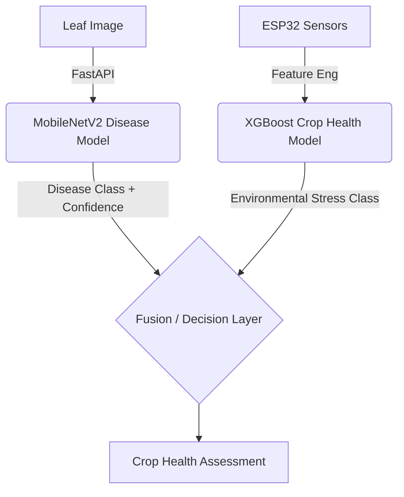

# SmartAgri AI Fusion Architecture & Assessment Plan

This document outlines the existing system architecture, current data flows, and the comprehensive design for the future AI Fusion Architecture. The objective is to produce a reliable Crop Health Assessment by combining plant image disease predictions with environmental telemetry and human-labelled observations.

---

## 1. Existing Architecture & Data Flow

### 1.1 Existing System Overview
- **Backend (Node.js/Express):** Handles sensor data ingestion, stores `SensorReading` and `CropHealthObservation` records in MongoDB, and exposes APIs for sensor previews and ML dataset exports.
- **AI Service (FastAPI):** Hosts the production `MobileNetV2` Phase 3 model for plant disease classification.
- **Frontend (React):** Contains the Sensor Dashboard, the Crop Health Data Collection interface, and the newly integrated Plant Disease Detection page.

### 1.2 Current Data Flow
1. **ESP32 Telemetry:**
   `ESP32` → `Backend API` → `MongoDB` → `SensorReading`
2. **Plant Disease Prediction:**
   `Leaf Image (Frontend)` → `FastAPI (/predict/plant-disease)` → `MobileNetV2` → `Disease Prediction (JSON)`
3. **Human Observations:**
   `Crop Health UI` → `Backend (/api/crop-health/observations)` → `MongoDB` → `CropHealthObservation` → `datasets/crop_health_training.csv`

---

## 2. Sensor Feature Engineering

### 2.1 Current Telemetry Features
- `soilMoisture` (%)
- `soilTemperature` (°C)
- `airTemperature` (°C)
- `humidity` (%)
- `lightIntensity` (lux)
- `rainDetected` (boolean)

### 2.2 Proposed Future Derived Features (To Be Implemented)
- **Time-based:** `time_of_day` (Morning, Afternoon, Evening, Night) to account for natural physiological changes (e.g., diurnal wilting).
- **Rolling Windows (e.g., 6h, 24h, 7d):**
  - `rolling_mean_air_temp`, `rolling_max_air_temp` (detect heatwaves)
  - `rolling_min_soil_moisture` (detect drought stress)
- **Trends:** Rate of change in soil moisture (`moisture_trend`) to distinguish between naturally dry soil vs rapidly drying soil.
- **Cumulative:** `recent_rainfall_state` (e.g., rained in the last 48 hours).

---

## 3. Temporal Matching Review

The current `CropHealthObservation` matching logic (implemented in `cropHealthController.ts`) operates as follows:
- **Matching Window:** Retrieves the nearest sensor reading within **+/- 15 minutes** of the observation timestamp.
- **Device Matching:** Matches strictly by `deviceId`.
- **Missing Sensor Behavior:** If no reading exists in the +/- 15-minute window, the API returns a `404` error and rejects the observation.
- **Duplicate Protection:** Rejects identical observations (same crop, same status, same device) within a **1-minute** window (`409 Conflict`).
- **Stale Readings:** Readings outside the 15-minute window are safely ignored, preventing stale telemetry from polluting the dataset.

*Conclusion:* The current matching logic is highly robust and sufficient for building a high-quality, synchronized dataset. No immediate changes are required.

---

## 4. Future Crop Health Model Design

### 4.1 Target Classes
- `Healthy`
- `Stressed`
- `Severely_Stressed`

### 4.2 Algorithm Candidates
- **XGBoost Classifier:** Strong baseline for tabular environmental data; handles non-linear relationships and missing data well.
- **Random Forest:** Good for feature importance interpretation and preventing severe overfitting on smaller datasets.
- **LightGBM:** Highly efficient alternative if dataset grows substantially.

### 4.3 Evaluation Priorities
- **Macro Recall & Macro F1:** Essential for imbalanced datasets.
- **Per-class Recall:** Priority is maximizing recall for `Stressed` and `Severely_Stressed`. Missing a stressed plant (False Negative) carries a much higher agronomic cost than falsely flagging a healthy plant (False Positive).

---

## 5. Dataset Requirements & Leakage Prevention

### 5.1 Dataset Targets
- **Current Genuine Observations:** 0
- **Minimum Target:** 500+ records.
- **Preferred Target:** 1000–2000+ records.
- **Diversity Requirements:** Must capture variations across different crops, times of day, weather conditions, soil moisture levels, and growth stages. (No synthetic data should be generated to meet these targets).

### 5.2 Leakage-Safe Splitting Strategy
Randomly splitting the dataset (e.g., standard 80/20 `train_test_split`) will cause severe data leakage due to the time-series nature of environmental data (consecutive readings are highly correlated).
- **Recommended Strategy:** Group K-Fold Cross-Validation.
- **Grouping Key:** Group by `deviceId` and `date window` (e.g., week). This ensures that the model is tested on entirely unseen time periods or completely distinct physical environments, providing a true measure of generalization.

---

## 6. AI Fusion Architecture

The ultimate goal is to fuse the image-based and sensor-based models into a holistic decision layer.

### 6.1 Fusion Logic
The system must retain and expose the underlying evidence rather than hiding it in a black box.
- **Disease Evidence:** e.g., Tomato Early Blight (91% confidence).
- **Environmental Evidence:** e.g., High Stress (due to low soil moisture and high temperature).
- **Final Assessment:** e.g., **HIGH HEALTH RISK**.

### 6.2 Confidence Handling Strategy
- **High Image Confidence, Low Sensor Stress:** Flag disease presence; advise that environmental conditions are currently optimal, suggesting pathogen introduction rather than environmental stress.
- **Low Image Confidence, High Sensor Stress:** Warn user of low image confidence, but strongly highlight the environmental stress. Recommend immediate watering/shade.
- **Missing/Stale Sensor Data:** Fallback gracefully. Assess purely on the Image Model but flag the assessment as "Incomplete Data".
- **Calibration:** Do not treat raw model softmax/probability scores as absolute scientific certainty unless mathematically calibrated. Use them as qualitative confidence bands (e.g., High, Medium, Low).

---

## 7. Future API Design

To support the fusion architecture, the `ai-service` should eventually expose:

1. **`POST /predict/plant-disease`** (Existing)
   - *Input:* `multipart/form-data` (Image)
   - *Output:* Disease classification and confidence.

2. **`POST /predict/crop-health`** (Future)
   - *Input:* JSON telemetry (Moisture, Temp, Humidity, etc.)
   - *Output:* Environmental stress classification.

3. **`POST /predict/combined-health`** (Future)
   - *Input:* `multipart/form-data` (Image) + JSON (Telemetry metadata or `deviceId` to fetch recent telemetry).
   - *Output:* Holistic Fusion Assessment (Disease Evidence + Sensor Evidence + Final Risk Level).

---

## 8. Future AI Guidance & Recommendation Architecture

*(Note: Treatment recommendations are NOT to be implemented until a scientifically validated agronomic knowledge base is integrated).*

When implemented, the recommendation structure must include:
- **Detected Issue:** (e.g., Early Blight + Heat Stress)
- **Supporting Evidence:** (Image match 91%, Soil Moisture < 20%)
- **Severity Level:** (Low, Medium, High, Critical)
- **Suggested Monitoring Action:** (e.g., "Check lower leaves for concentric rings", "Verify irrigation lines")
- **Confidence Level:** (High/Medium/Low)
- **Mandatory Disclaimer:** "This is an AI-generated assessment. Consult a local agronomist before applying chemical treatments."

---

## 9. Risks and Limitations
- **Data Scarcity:** The current lack of genuine human-labelled crop health observations completely blocks the training of the environmental stress model.
- **Sensor Drift:** ESP32 sensors (especially capacitive soil moisture and DHT22) can drift or degrade over time, leading to false stress predictions if not periodically re-calibrated.
- **Generalization:** A model trained on observations from one region/climate may not easily generalize to another without transfer learning.
